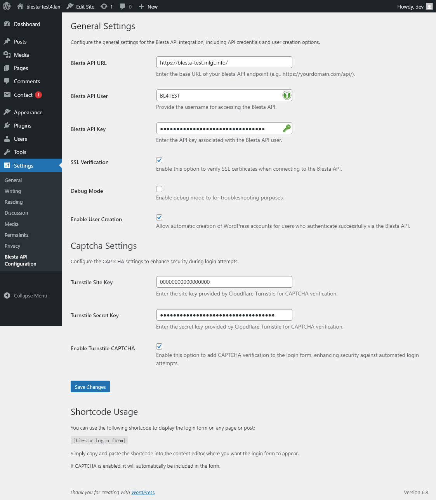

# Blesta Login Integration Plugin

## Description
The Blesta Login Integration plugin allows users to log in to WordPress using their Blesta username and password. This plugin integrates seamlessly with the Blesta API to authenticate users and provides additional options for user creation and CAPTCHA verification.

## Features
- Authenticate WordPress users using Blesta credentials.
- Automatic WordPress account creation for authenticated users (optional).
- CAPTCHA verification using Cloudflare Turnstile.
- Debug mode for troubleshooting API requests and responses.
- Configurable API settings via the WordPress admin panel.

## Installation
1. Download the plugin files and place them in the `wp-content/plugins` directory of your WordPress installation.
2. Activate the plugin from the WordPress admin panel under the "Plugins" section.
3. Navigate to "Settings > Blesta API Configuration" to configure the plugin.

## Configuration
1. Provide the Blesta API URL, username, and API key in the settings page.
2. Optionally enable SSL verification and debug mode.
3. Configure CAPTCHA settings by providing the Cloudflare Turnstile site and secret keys.
4. Save the changes.

## Security Disclaimer
**Important:** Ensure that your Blesta API endpoint is secured with a Web Application Firewall (WAF) or similar security measures. The plugin relies on the security of the API endpoint to protect user credentials and sensitive data.

## Translation
The plugin supports multiple languages. To add more translations, create a `.po` file in the `languages` directory and compile the translation files.

## Contributing
Contributions are welcome! Feel free to submit issues or pull requests to improve the plugin.

## Disclaimer
This plugin is provided "as is" without any warranty of any kind. Use it at your own risk. The authors are not responsible for any damage or data loss caused by the use of this plugin.
